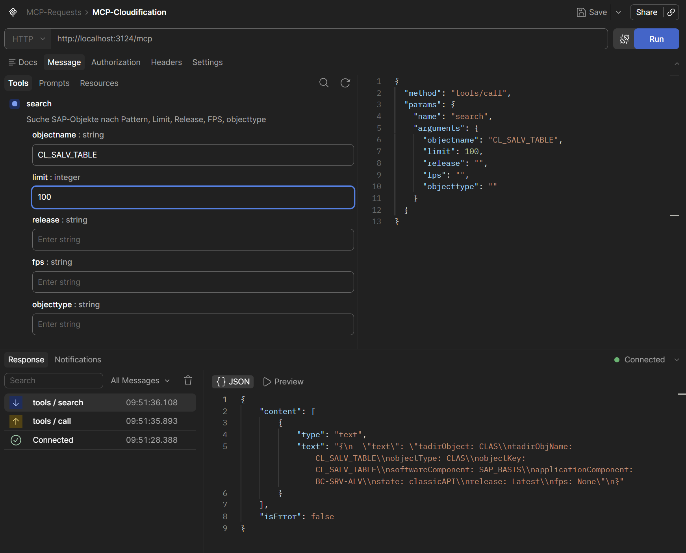

# MCP Cloudification-Repository Server

Ein MCP-Server, der das öffentliche SAP-Repository [abap-atc-cr-cv-s4hc](https://github.com/SAP/abap-atc-cr-cv-s4hc) durchsuchbar macht — direkt aus deinem KI-Tool heraus. Kein Browser, kein manuelles JSON-Wühlen.

## Was macht das hier eigentlich?

SAP pflegt ein Git-Repository mit Informationen darüber, welche ABAP-Objekte in S/4HANA Cloud verfügbar sind, welchen Release-Stand sie haben und ob es Nachfolger gibt (Cloudification-Pfad). Dieses Projekt macht genau diese Daten über das **Model Context Protocol (MCP)** als Tool verfügbar — sodass ein KI-Assistent wie Github Copilot in Eclipse oder Claude etc. direkt danach suchen kann.

Beim Start:
1. wird das SAP-Repo automatisch geclont (falls noch nicht vorhanden)
2. werden alle JSON-Dateien in eine lokale SQLite-Datenbank geladen
3. startet ein MCP-HTTP-Server, der das `search`-Tool bereitstellt

## Voraussetzungen

- Python 3.11+
- Git (muss im PATH sein)

```bash
pip install -r requirements.txt
```

Für Entwicklung (inkl. pytest):
```bash
pip install -r requirements-dev.txt
```

## Starten

```bash
python server.py
```

Der Server läuft dann auf Port **3124** und ist unter `http://localhost:3124/mcp` erreichbar.

### Optionen

| Flag | Default | Beschreibung |
|------|---------|--------------|
| `--port` | `3124` | Port des MCP-Servers |
| `--force-reload` | `false` | Repo löschen und neu clonen |
| `--cloudification-url` | SAP-Repo-URL | Eigene Git-URL verwenden |

```bash
# Anderer Port
python server.py --port 8080

# Repo neu clonen (z.B. nach Update)
python server.py --force-reload

# Eigenes Fork-Repo
python server.py --cloudification-url https://github.com/mein-org/mein-fork
```

## Mit Docker

```bash
docker build -t mcp-cloudification .
docker run -p 3124:3124 mcp-cloudification
```

Das Image läuft als non-root User (`appuser`). Das Repo wird zur Laufzeit in den Container geclont — kein Datenstand im Image eingebacken.

## Das `search`-Tool

Das einzige Tool, das der Server nach außen anbietet. Parameter:

| Parameter | Typ | Default | Beschreibung |
|-----------|-----|---------|--------------|
| `objectname` | string | `*` | Objektname oder Pattern (`*VBAK*`, `CL_*`, ...) |
| `limit` | int | `100` | Maximale Trefferzahl |
| `release` | string | `Latest` | SAP-Release, z.B. `2302`, `2402` |
| `fps` | string | — | Feature Pack Stack, z.B. `FPS01` |
| `objecttype` | string | — | Objekttyp, z.B. `TABL`, `CLAS`, `FUGR` |

Wildcards (`*`) werden in SQL-`LIKE`-Patterns übersetzt. Ohne `release`-Filter wird immer `Latest` verwendet.

Die Ausgabe ist im **TOON-Format** — ein kompaktes Textformat, das Objektmetadaten plus eventuelle Nachfolger auflistet.

### Beispiel-Request (Postman)

Der MCP-Server lässt sich direkt mit dem Postman MCP-Client testen — einfach `http://localhost:3124/mcp` als HTTP-Endpunkt eintragen:



Das Request-JSON dahinter sieht so aus:

```json
{
  "method": "tools/call",
  "params": {
    "name": "search",
    "arguments": {
      "objectname": "CL_SALV_TABLE",
      "limit": 100,
      "release": "",
      "fps": "",
      "objecttype": ""
    }
  }
}
```

## Einrichtung in Eclipse (GitHub Copilot)

Der Server lässt sich als MCP-Server in Eclipse einbinden — vorausgesetzt das **GitHub Copilot Plugin** ist installiert und auf einer Version, die MCP-HTTP-Server unterstützt.

### Schritt 1: Server starten

Lokal oder per Docker — der Server muss laufen bevor Eclipse ihn ansprechen kann:

```bash
python server.py   # lokal
# oder
docker run -p 3124:3124 mcp-cloudification
```

### Schritt 2: MCP-Server in Eclipse konfigurieren

In Eclipse: **Window → Preferences → GitHub Copilot → MCP Servers**

Dort neuen Server hinzufügen oder direkt die JSON-Konfiguration eintragen:

```json
{
  "servers": {
    "Cloudification": {
      "type": "http",
      "url": "http://localhost:3124/mcp"
    }
  }
}
```

Für einen remote laufenden Server (z.B. Docker auf einem anderen Host) einfach `localhost` durch die IP/den Hostnamen ersetzen:

```json
{
  "servers": {
    "Cloudification": {
      "type": "http",
      "url": "http://192.168.1.42:3124/mcp"
    }
  }
}
```

### Schritt 3: Nutzen

Nach dem Neustart von Eclipse steht das `search`-Tool im Copilot-Chat zur Verfügung. Einfach in natürlicher Sprache fragen:

> *"Ist die Tabelle VBAK in S/4HANA Cloud freigegeben?"*
> *"Welche Nachfolger gibt es für CL_SALV_TABLE?"*
> *"Zeig mir alle FUGR-Objekte im Release 2402."*

## Projektstruktur

```
server.py                          # Einstiegspunkt, MCP-Tool-Registrierung
cloudification/
    object_repository.py           # SQLite-Aufbau + Suche
    partner_repository.py          # Partner-Klassifizierungen laden
    git_clone.py                   # Git-Clone-Helfer
    formatter.py                   # TOON-Ausgabeformat
requirements.txt                   # Runtime-Dependencies
requirements-dev.txt               # Dev-Dependencies (pytest)
Dockerfile
.dockerignore
```

## Partner-Objekte

Im Repo gibt es unter `src/partner/` JSON-Dateien mit Klassifizierungen von SAP-Partnern. Diese werden beim Start ebenfalls geladen und bei jeder Suche automatisch mit den SAP-Ergebnissen zusammengeführt.
